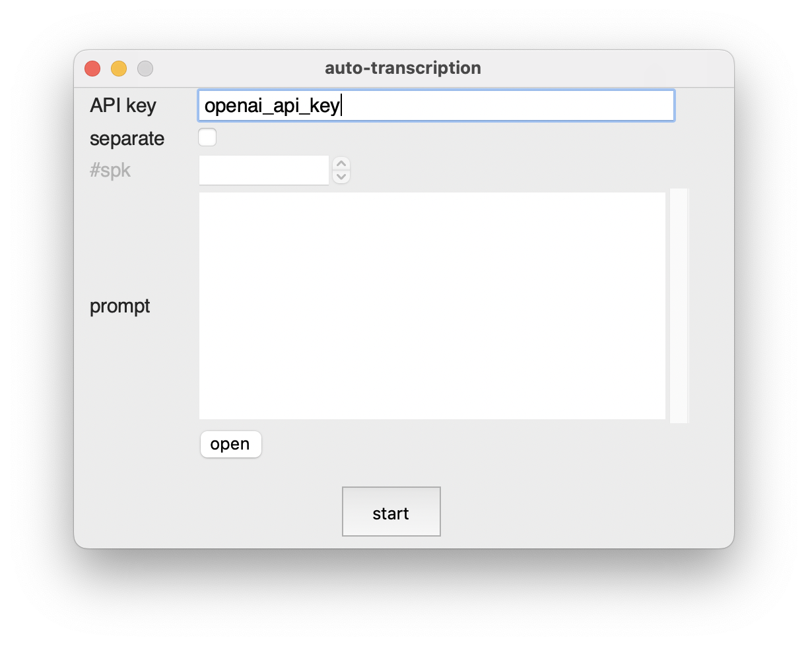

# auto-transcription

This is a GUI application that **automatically transcribes speech** and **performs speaker diarization** from an audio file, then **exports the results to an Excel (.xlsx) file**.  
It utilizes OpenAI’s Whisper model for speech recognition, `pyannote.audio` for speaker diarization, and Python’s built-in `tkinter` for the graphical interface.

---

## ✨ Features

- Transcribe speech from audio files (speech recognition)
- Perform speaker diarization (separate who spoke what)
- Export analysis results as an Excel (.xlsx) file
- Simple GUI for easy operation by anyone

---

## 🔧 Setup

### 1. Prepare API keys

Place the following files in the root directory of the project:

- `openai_api.txt`: Contains your OpenAI API key (for Whisper), one line only  
- `use_auth_token.txt`: Contains your Hugging Face access token (for pyannote.audio), one line only

### 2. Create Conda environment

```bash
conda create -n audio python=3.8
conda activate audio
pip install -r requirements.txt
```

## 🚀 Launching the App
Use the following command to launch the GUI application:
```bash
python audio_gui.py
```

<p align="center">  </p> 